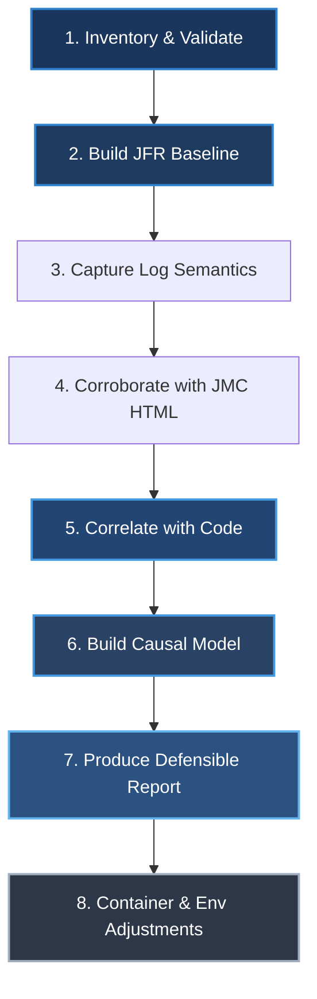
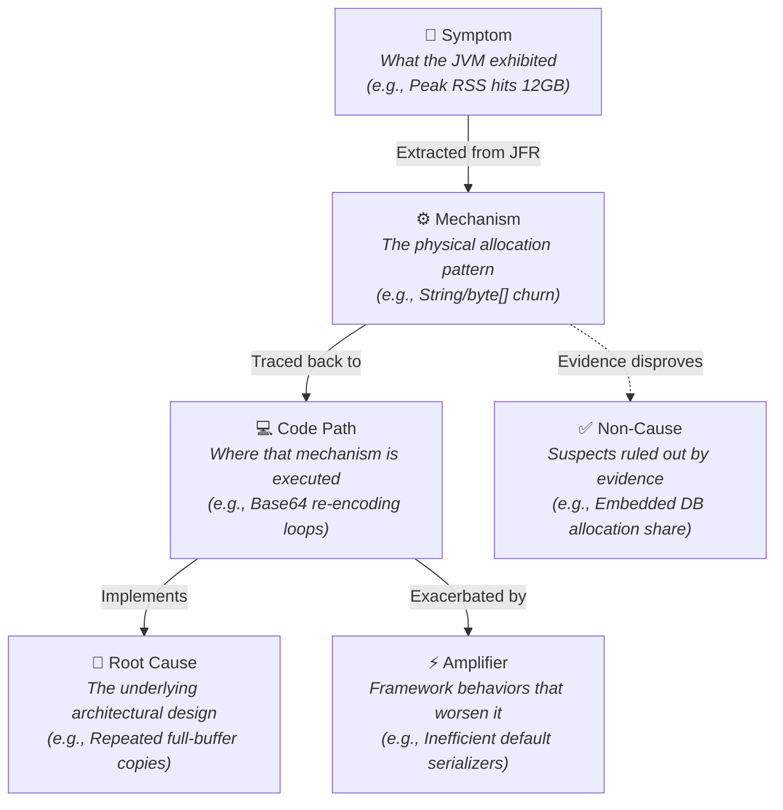

# Java JFR Diagnostics

[](https://creativecommons.org/licenses/by/4.0/)
[](#)
[](#)
[](#)

A structured, evidence-based diagnostic framework and AI-agent skill for converting raw Java runtime artifacts—`.jfr` recordings, application logs, and Java Mission Control (JMC) reports—into clear, rigorous, and defensible performance insights.

Instead of simply paraphrasing profiler output, this project defines a methodology to establish **exactly what happened**, evaluate **evidence confidence**, map hotspots to **concrete code paths**, and formulate **causal models** to drive high-impact optimization decisions.

---

## Repository Structure

```text
java-jfr-diagnostics/
├── README.md                        # Comprehensive framework guide and project overview (this file)
├── SKILL.md                         # Core AI Agent Skill definition containing the diagnostic workflow
└── references/
    ├── command-checklist.md         # Detailed checklist and reference for JFR CLI commands
    └── report-template.md           # Structured template for diagnostic reports
```

---

## How to Use This Project

### As an AI Coding Assistant Skill
This repository serves as a **highly structured skill definition** (`SKILL.md`) for AI agents. It instructs the agent on how to methodically approach performance investigations, ensuring they gather objective metrics before jumping to conclusions.
* **Importing**: Provide `SKILL.md` and the `references/` directory as context to your AI agent when asking them to profile or diagnose a Java application.
* **Trigger**: Activate this skill when asked to inspect JFRs, compare runs, diagnose GC, memory, CPU, thread scheduling, virtual thread pinning, lock contention, native memory, or I/O issues, or write a post-mortem/performance report.

### As a Developer Reference
Developers can use `references/command-checklist.md` as a quick-reference guide during incident response or performance tuning cycles. It provides copy-pasteable commands for the standard `jfr` CLI utility, covering 14 diagnostic categories from basic metadata to container-aware analysis. Use `references/report-template.md` as a starting point for writing structured performance reports.

---

## The 8-Step Diagnostic Methodology

The project advocates a highly disciplined, non-linear diagnostic process outlined in `SKILL.md`:



1. **Inventory & Validate**: Check log timelines against the JFR recording duration, identify if a recording was truncated due to ring buffers (e.g., `maxsize`), extract JVM arguments (`-Xmx`, GC selection), and identify JDK version for feature availability.
2. **Build JFR Baseline**: Query raw metrics using `jfr CLI` to extract peak RSS, peak heap, native memory, GC pause durations, allocation hotspots, CPU hotspots, and saturation data.
3. **Capture Log Semantics**: Match timelines, workloads, task counts, retries, and errors to align what the application *thought* it was doing with what the JVM *exhibited*.
4. **Corroborate with JMC HTML**: Check automated JMC reports to challenge or support your JFR baseline observations, using raw JFR data as the ultimate source of truth.
5. **Correlate with Code**: Trace hot stack frames and allocation sites back to the codebase. Classify them into specific operational categories (e.g., root cause, amplifier, noisy byproduct). Check for virtual thread pinning, lock contention, and profiling artifacts.
6. **Build a Causal Model**: Model the performance bottleneck using a rigid chain of causality.
7. **Produce a Defensible Report**: Package findings into an Executive Summary featuring metrics tables, confidence levels, scenario comparisons, and recommendations that preserve functional guarantees. Use the provided report template.
8. **Container & Environment Adjustments**: Apply container-aware checks for cgroup limits, OOM-kill risk, CPU quota effects, and network I/O in microservice deployments.

---

## Quick-Reference JFR Commands

Below is a curated summary of essential diagnostics commands provided in `references/command-checklist.md`:

| Category | Command | Target Metrics |
| :--- | :--- | :--- |
| **Metadata & Coverage** | `jfr summary run.jfr` | Recording duration, event counts, baseline validity |
| **GC & Memory Pauses** | `jfr view gc-pauses run.jfr` | Total pauses, pause time percentiles (P90, P99), max pause |
| **Memory Allocation** | `jfr print --events jdk.ResidentSetSize run.jfr`<br>`jfr print --events jdk.GCHeapSummary run.jfr` | Peak RSS, peak heap used, committed heap size |
| **Native Memory** | `jfr view native-memory-committed run.jfr` | Off-heap memory by NMT category |
| **CPU & Hotspots** | `jfr view cpu-load run.jfr`<br>`jfr view hot-methods run.jfr` | CPU saturation, top methods by sample count |
| **Thread Analysis** | `jfr view thread-allocation run.jfr`<br>`jfr view thread-count run.jfr` | Per-thread allocation, active thread count |
| **Allocation Hotspots** | `jfr view allocation-by-class run.jfr`<br>`jfr view allocation-by-site run.jfr` | Top allocating classes (`byte[]`, `String`), hot code paths |
| **Lock Contention** | `jfr print --events jdk.JavaMonitorEnter run.jfr` | Monitor contention, lock convoy detection |
| **Virtual Threads** | `jfr view pinned-threads run.jfr`<br>`jfr print --events jdk.VirtualThreadPinned run.jfr` | Carrier pinning events, submit failures |
| **Safepoints** | `jfr view safepoints run.jfr` | Non-GC stop-the-world pauses, profiling bias |
| **Exceptions** | `jfr view exception-count run.jfr` | Exception creation rate and type distribution |
| **Containers** | `jfr view container-memory-usage run.jfr` | cgroup limits, OOM-kill risk assessment |

---

## Causal Model Framework

A successful diagnosis distinguishes between different roles in a performance problem. The framework defines these roles as:



---

## Confidence Level Framework

Every conclusion in a diagnostic report must carry an explicit confidence level:

| Level | Criteria |
| :--- | :--- |
| **High** | Multiple independent sources agree (JFR + logs + code). Complete causal chain. No contradicting data. |
| **Medium** | Two sources agree or one strong source (raw JFR) supports it. One causal link is inferred. |
| **Low** | Single weak signal. Key data missing, partial, or contradictory. Needs targeted experiment. |
| **Ruled out** | Evidence explicitly contradicts the hypothesis. State what disproved it. |

---

## Important Guidelines

> [!NOTE]
> Performance-heavy code often protects critical guarantees like restart safety, idempotency, or transaction ordering. Always separate operational guarantees from the current representation format (e.g., do not suggest removing an expensive backup routine before understanding the restart requirement).

> [!IMPORTANT]
> The HTML JMC output is a *derived summary* with opinionated heuristics. If JMC HTML recommendations conflict with raw JFR CLI output, **always trust the raw recording** and seek to explain the discrepancy.

> [!WARNING]
> A JFR file whose duration is shorter than the application log timeline is **partial** (often due to ring buffer caps). Downgrade partial JFR recordings to supporting evidence, and do not use them for direct, symmetric comparison against full recordings.

> [!CAUTION]
> JFR CPU sampling is subject to **safepoint bias** — samples are only collected at safepoint polls, which can over-represent certain methods. Cross-reference `hot-methods` with allocation data and use `-XX:+DebugNonSafepoints` for future recordings when precise CPU attribution matters.

---

## Metadata & License

* **Author**: Erik da Rosa Rodriguez (erik@rodgz.com)
* **Version**: `2.0.0`
* **License**: [CC-BY-4.0](https://creativecommons.org/licenses/by/4.0/) (Creative Commons Attribution 4.0 International)
